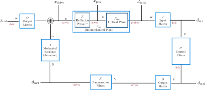

# Control System Overview

*__Note: the PyTickle convention is that control signals are directly summed into the error point without an explicit minus sign.__ Loops thus go unstable when open-loop transfer functions (OLTFs) are +1 and the Nyquist criteria requires the Nyquist contour to circle the point +1 clockwise the same number of times as there are right half plane poles in the OLTF.*

Here is a detailed overview of the architecture of the control systems for reference. The Optickle and Finesse examples for controlling a Fabry Perot Michelson interferometer ([available here](../examples/FPMI/)) show a detailed example and explain the optomechanical plant and related test points in more detail.

&nbsp;

* Signal types. There are three types of signals. The type of signal propagating along each link in the diagram above is shown in red. The units of each signal are also marked.
    * Drives: These are the inputs to a model, for example mirror motion (longitudinal, pitch, or yaw) or laser frequency modulation.
    * Probes: These are the photodiodes that sense the power at various ports of the model, for example `REFL_I`, `AS_Q`, etc.
    * Degrees of Freedom (DOFs): These are the degrees of freedom relevant to the model, for example DARM, CARM, MICH, PRCL, and SRCL for the longitudinal DOFs in a dual-recycled Fabry Perot Michelson interferometer.
    

&nbsp;

    
* The blocks have the following meanings:
    * The optomechanical plant is the AC transfer function from drives to probes and is what Optickle and Finesse calculate with `opt.getTF(probe, drive)` and `katFR.getTF(probe, drive)`. Conceptually it can be broken down into a radiation pressure "loop suppression function" which modifies the mechanical response of mirrors and an optical plant which only includes the optical response. This mechanical modification is computed with `opt.getMechMod(drive_out, drive_in)` and `katFR.getMechMod(drive_out, drive_in)`. The optical plant can be calculated in Optickle with `opt.getTF(probe, drive, optOnly=True)` but cannot be computed in Finesse at this time. See the examples for details.

    * The input matrix defines which probes are used to sense each DOF.

    * The control filters define the feedback and feedforward dynamics of the loop.
    
    * The output matrix defines which combinations of drives make up each DOF.

    * The actuation function is the transfer function from the point that the control loop actuates on each drive to the motion of that drive. In the example of a multi-stage suspension used for a test mass mirror, the position of the mirror may be actuated on by applying a force on the stage above rather than on the mirror itself. The function is then the mechanical plant from forces on this stage to test mass motion.
    
    * The compensation filters invert the actuation plants with the goal to make the product approximately one.

&nbsp;

* Test points. These are the points along the loop where signals can be probed or injected and are marked as arrows going into or out of the loop.
    * The difference between the `drive` and `pos` test points is described in detail in the examples, but can be understood simply as follows. The effects of radiation pressure can be thought of as a feedback loop. The block R is the closed loop transfer function of this radiation pressure loop, `drive` is the input signal to the loop, and `pos` is the output signal from the loop.
    * The name used in PyTickle to refer to each test point is the same as the subscript in the figure. So, for example, to compute the transfer function from `err` to `pos`, you'd use `cs.getTF(sig_to, pos, sig_from, err)`
    * The test point `spot` is not shown in the diagram but exists for angular DOFs to convert the test point `drive` into beamspot motion on an optic.
    * With the exception of `pos` (which only probes a signal) and `cal` (which only injects a signal), all test points can both probe and inject signals.
